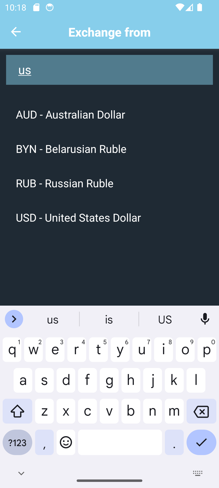

# Currency Converter - An app for converting currencies

A persistent app for converting currencies, made in React Native.

## Features

The app is made with React Native and utilizes [Redux](https://redux.js.org/) to manage the state of the app, to ensure it that everything works and transfers between different screens. This is stored locally using [Async Storage](https://react-native-async-storage.github.io/async-storage/), to ensure that the app stays persistent and that the last used currencies are loaded in on launch.

The app is able to work entirely offline, after data containing the rates have been loaded in _once_. The rates will also be store locally and can of course be updated by fetching the [API](https://forexvalutaomregner.dk/pages/api), whenever the user wants.

### Currencies supported

Over **180+ currencies** supported, including cryptocurrencies! Using the [API](https://moneyconvert.net/pages/api) from [Money Convert](https://moneyconvert.net/), to fetch the rates for the different currencies.

